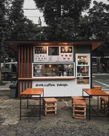
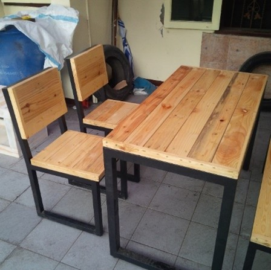
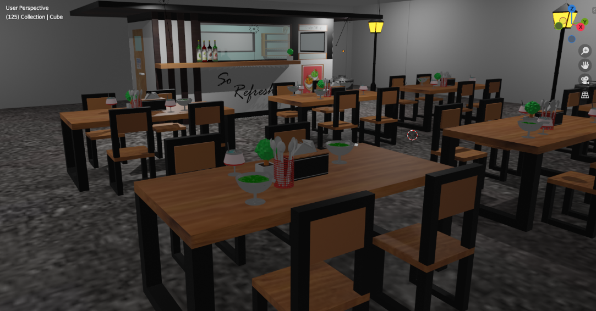
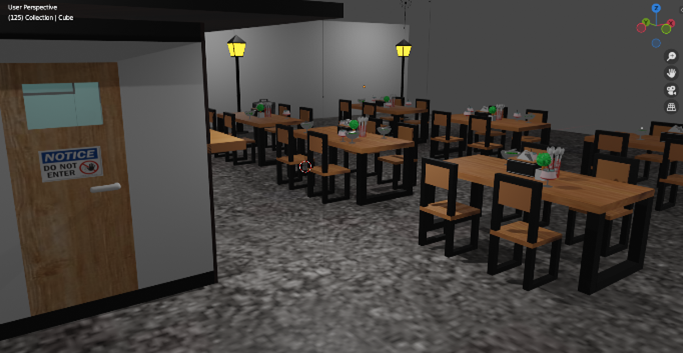
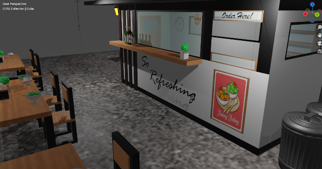
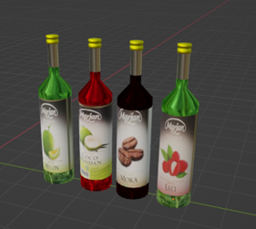
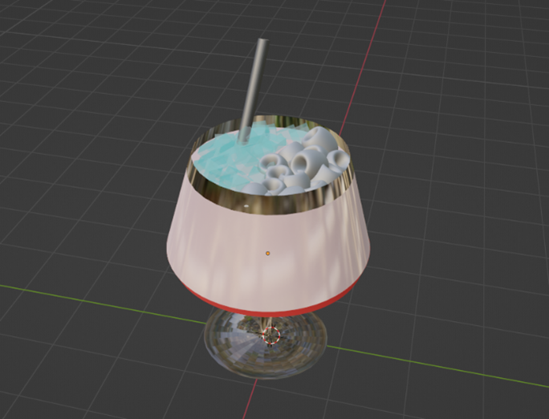

# ☕ 3D Stall/Cafe Interior Model Description
This project is a 3D model of an outdoor food stall or casual cafe interior, highly inspired by the popular 'kaki lima' (street food vendors) and small, modern coffee shops often found in urban areas. The design blends a cozy, functional interior space with an accessible, open-air seating arrangement.

--- 

## 🎨 Key Features and Inspiration

The model was created using Blender and captures the atmosphere of a typical small eatery, as evidenced in the provided object view images.

### References: 

 | 

Design Aesthetic: The model adopts a minimalist industrial style, characterized by the exposed structure and the contrast between wood and dark metal.

Reference: The tables and chairs feature dark, square metal frames and natural wooden surfaces, directly referencing the style seen in the inspiration. This furniture is practical and durable, mirroring the look of custom furniture common in these types of establishments.

### Stall View

 |  | 

Stall/Counter Area: The focal point is the service counter, which is designed to be inviting. It includes a signboard, a prominent sign that says "So Refreshing", and a poster for a signature dish.

Inspiration: The overall open layout and modern structure are inspired by contemporary street vendor stalls and pop-up cafes.

---

## 🍹 Detailed Props and Assets

To enhance the realism and cultural context of the cafe, several detailed props were created:

Marjan Syrup Bottles: A collection of highly detailed Marjan brand syrup bottles were modeled and textured, featuring popular Indonesian flavors like Melon, Coco Pandan, Moka, and Lychee. This instantly recognizable prop adds authenticity and context to the drink preparation area.

Lychee Mocktail: A custom drink asset, identified as a Lychee Mocktail, was created. The model features a stylized glass with a detailed texture for the clear, icy blue drink, complete with small floating elements (suggestive of lychee fruit pieces) and a silver straw. This asset is intended for placement on the dining tables.

--- 

## Project Goal

The primary goal of this 3D model was to create a realistic yet stylized representation of a contemporary casual dining stall, capturing the vibrant and approachable ambiance of the original outdoor street stall inspiration.